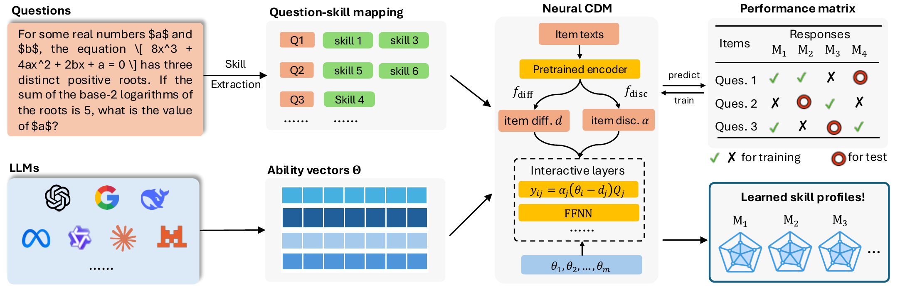

# SkillEval

Skill-level evaluation of large language models with cognitive diagnosis models.

A single benchmark score hides what a model can and cannot do. SkillEval extracts the skills that each
benchmark question requires, groups them into 100 named skills, and fits a neural cognitive diagnosis model
on the answers of 3,811 open LLMs to 9,523 questions from MATH, BBH, GPQA, MuSR and IFEval. Every model gets
a mastery profile over the named skills. The profiles are used to predict performance on unseen questions, to
route each question to a cheaper model that can answer it, and to profile new models from a few answers.



- **Demo website:** [berkearda.github.io/skilleval](https://berkearda.github.io/skilleval/) (source in [`demo/`](demo/))
- **Skill list, Q-matrix and the list of evaluated LLMs:** in [`release/`](release/)
- **Skill profiles of all 3,811 LLMs:** in [`demo/public/data/theta_matrix.json`](demo/public/data/theta_matrix.json);
  the trained model will be released with the paper
- **Paper:** forthcoming

## Repository layout

| Path | Contents |
|---|---|
| `cdmeval/` | Python package: skill extraction and Q-matrix construction (`skills/`), the text-conditioned neural CDM and the baseline models (`modeling/`), training, metrics and routing evaluation (`evaluation/`), data loading (`data/`) |
| `configs/` | Hydra configuration used by the training scripts |
| `tools/` | Scripts for the experiments, analyses and figures (`run_*`, `diag_*`, `fig_*`); the `*.sbatch` files are the SLURM launchers used on a cluster |
| `cdm_exploration/experiments/` | Result files (JSON) behind the reported numbers; `experiment_log.json` records every run |
| `cdm_exploration/figures/` | Figures; the final ones are in `report/main_ready/` and `report/appendix_ready/` |
| `cdm_exploration/scripts/` | The first version of the pipeline |
| `release/` | The 3,811 evaluated LLMs (`llm_list.csv`), the 100 skills (`skill_list.csv`) and the Q-matrix, the skills of each item (`qmatrix_K100.csv`) |
| `demo/` | The demo website |
| `tests/` | Tests |

The Python package is called `cdmeval`, the project's earlier name.

## Quickstart

```bash
git clone https://github.com/berkearda/skilleval.git
cd skilleval
pip install -e .
python tools/download_data.py
python tools/train_expanded.py --config-name paper
```

`download_data.py` downloads the item-level results and builds everything the training script reads (see
[Data](#data)). `train_expanded.py --config-name paper` trains the paper's main model on a GPU, on Apple silicon
or on the CPU, whichever is available. It prints the test AUC and the routing accuracy and adds an entry to
`cdm_exploration/experiments/experiment_log.json`.

To check the setup in about a minute on a laptop CPU:

```bash
python tools/train_expanded.py --config-name paper '+subset.n_llms=100' model.epochs=3 device=cpu
```

This trains on 100 LLMs for three epochs and should print a test AUC of about 0.70.

Python 3.11 or newer. Optional extras: `.[figures]` for the plotting scripts, `.[extract]` for skill extraction
with an LLM API, `.[baselines]` for the EduCDM baselines and `.[dev]` for the tests
(for example `pip install -e ".[figures]"`).

## Data

The per-item responses come from RouterEval (Huang et al., 2025; MIT licence), which collects the item-level
results of the Open LLM Leaderboard v2. They are not redistributed here. `tools/download_data.py` downloads them
from the Hugging Face Hub at a pinned revision, checks their SHA-256 and writes to `cdm_exploration/data/cdm_ready/`:

| File | Contents |
|---|---|
| `response_matrix_v2_full.npy` | Responses of 3,811 LLMs to 9,523 items, 1 = correct |
| `response_matrix_v2_full_llms.json` | LLM names, in row order |
| `response_matrix_v2_full_items.json` | Benchmark, subtask and a short excerpt of each item |
| `item_text_embeddings_v2_full.npz` | Item-text embeddings (all-mpnet-base-v2) |
| `qmatrix_v2_K100.npy` | The Q-matrix |

These are the files the paper's model was trained on. The Q-matrix is also in `release/qmatrix_K100.csv`: one
row per item with the ids of its skills (0 to 99, as in `skill_list.csv`). The mastery profile of each LLM over the
100 skills, from the main model, is in `demo/public/data/theta_matrix.json`. The trained model will be released with
the paper.

Files that quote GPQA questions are not included, because the GPQA authors ask that its questions not be
posted in plain text. The human-evaluation sheets in `cdm_exploration/experiments/human_eval/` keep the
annotators' judgments without the question text.

## Where the main results come from

| Result | Scripts |
|---|---|
| Data | `tools/download_data.py`, `tools/build_response_matrix_v2.py` |
| Skill extraction and Q-matrix | `tools/extract_skills_v2.py` (prompt in `cdmeval/skills/extraction.py`), `tools/cluster_skills.py` |
| Main model and routing | `tools/train_expanded.py --config-name paper`, `tools/diag_table4_routing_summary.py` |
| Item-level prediction and baselines | `tools/run_ncdm_protocolA.py`, `tools/run_multi_seed.py`, `tools/run_irt_baseline_v2.py`, `tools/run_irtnet_headtohead.py`, `tools/run_knn_baseline.py` |
| Benchmark-level prediction | `tools/diag_benchpred_skilleval_vs_irtnet.py` |
| Stability of the profiles | `tools/compare_theta_stability.py` |
| Cost and accuracy of routing | `tools/run_pareto_multibaseline.py` |
| Profiling unseen LLMs | `tools/run_profiling_bayes.py`, `tools/run_profiling_bayes_adaptive500.py` |
| Cross-benchmark transfer | `tools/run_cross_benchmark_transfer.py` |
| Base and instruction-tuned models | `tools/run_alignment_tax.py` |
| Co-mastery between skills | `tools/run_skill_prerequisites.py` |
| Human validation of the skill assignments | `tools/make_human_eval_csv.py`, `tools/score_human_eval_agreement.py` |
| Release lists of LLMs and skills | `tools/build_release_lists.py` |

## Citation

A paper describing SkillEval is forthcoming; its citation will be added here.

## License

Code: MIT (see `LICENSE`). Data derived from the benchmarks follow the licenses of the original datasets.
